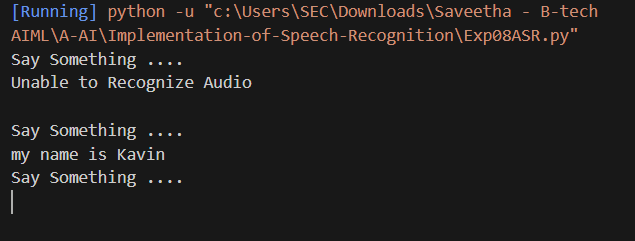

 <H3>NAME:Kavinraja D</H3>
<H3>REGISTER NO:212222240047</H3>
<H3>EX.NO:8</H3>
<H3>DATE:</H3>
<H1 ALIGN =CENTER>Implementation of Speech Recognition</H1>

## AIM:
To implement the conversion of live speech to text.
## ALGORITHM:
### STEP 1:
Import the speech_recognition library.
### STEP 2:
Initialize the Recognizer.
### STEP 3:
Create an instance of the Recognizer class, which will be used for recognizing speech.
### STEP 4:
Set the duration for audio capture.
### STEP 5:
Define a variable to specify the duration (in seconds) for which the program will capture audio from the microphone.
### STEP 6:
Display a message in the console to prompt the user to speak.
### STEP 7:
Capture audio from the default microphone.
### STEP 9:
Use the default microphone as the audio source.
### STEP 10:
Record audio for the specified duration using the Recognizer instance.
### STEP 11:
Perform speech recognition with exceptional handling:<Br>
•	Attempt to recognize speech from the captured audio using the Google Speech Recognition service.<Br>
•	If successful, print the recognized text.<Br>
•	Handle specific exceptions: If the recognition result is unknown or if there is an issue with the request to the Google Speech Recognition service, print corresponding error messages.<Br>
•	A generic exception block captures any other unexpected errors.<Br>

## PROGRAM:
```py
import speech_recognition as sr
def record_audio():
    r=sr.Recognizer()
    r.energy_threshold = 6000
    voicedata=''
    try:
        with sr.Microphone() as source:
            audio=r.listen(source)
            voicedata=r.recognize_google(audio)            
    except sr.UnknownValueError:
        print("Unable to Recognize Audio")
    except sr.RequestError:
        print("Unable to find the Resource")
    return voicedata
while True:
    print("Say Something ....")
    text=record_audio()
    print(text)
    if text=="stop" or text=="close" or text=="exit":
        exit(1)
```

## OUTPUT:

## RESULT:
Thus, the python program for Speech Recognition is implemented successfully.
